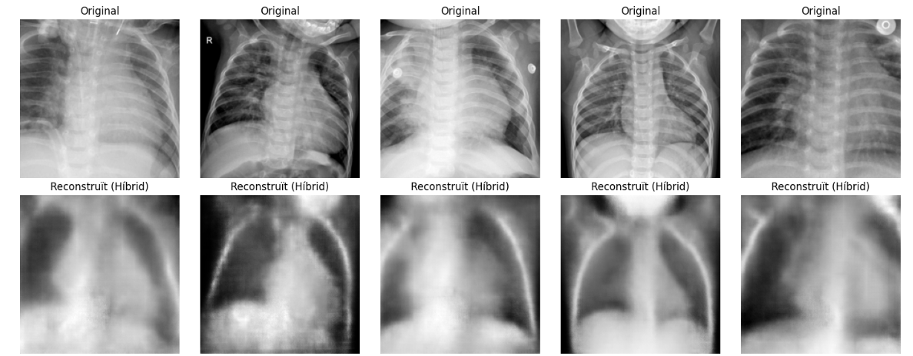
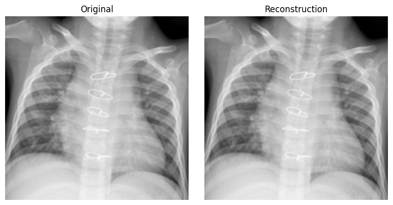
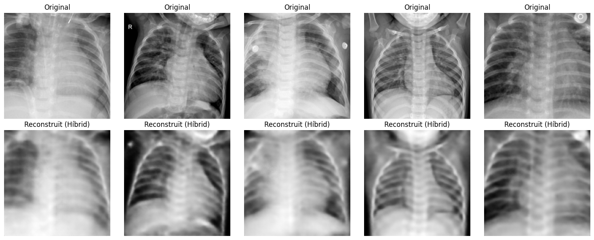

# Optimització Major: Arquitectura Híbrida i Càrrega VRAM

Aquesta versió introdueix canvis estructurals crítics per solucionar colls d'ampolla de rendiment i problemes d'estabilitat numèrica (NaNs), a més de millorar la qualitat visual de les reconstruccions mèdiques.

## Resum de Rendiment
El model ha convergit satisfactòriament després de 100 èpoques, mostrant una reducció dràstica de l'error sense signes d'overfitting (la *Val Loss* es manté enganxada a la *Train Loss*).

| Mètrica | Inici (Epoch 1) | Final (Epoch 100) | Millora |
| :--- | :--- | :--- | :--- |
| **Train Loss** | 0.06383 | **0.00349** | -94.5% |
| **Val Loss** | 0.04433 | **0.00406** |  -90.8% |

###  Resultats Visuals
Comparativa entre la radiografia original i la reconstrucció del nou Decoder CNN:

*(Nota: S'observa la millora en textures orgàniques i absència d'artifacts de tipus quadrícula)*

---

## Llista Detallada de Canvis

### 1. Gestió de Dades (Data Pipeline) 
* **Implementació de `TurboDataset` (Càrrega a VRAM):**
    * **Canvi:** S'ha eliminat la càrrega dinàmica disc-CPU-GPU. Ara tot el dataset es carrega a la VRAM a l'inici.
    * **Justificació:** El dataset PneumoniaMNIST (224x224, uint8) ocupa només **~280 MB** desplegat. Amb una GPU T4 (16 GB), utilitzem menys del 2% de memòria. Això elimina totalment el coll d'ampolla i accelera l'entrenament d'hores a minuts.
* **Estabilitat `Float32`:**
    * **Canvi:** Entrada convertida a `.float()` (32-bit) en lloc de forçar `.half()` (16-bit).
    * **Justificació:** Forçar 16-bit a l'entrada causava `NaNs` i valors infinits en losses petites. L'estabilitat de 32-bit és prioritària; la velocitat es gestiona via Autocast.

### 2. Arquitectura del Model (ViT Híbrid) 
* **Nou Decoder CNN:**
    * **Canvi:** Substitució del Decoder basat en Transformers per un basat en Convolucions (`ConvTranspose2d`).
    * **Justificació:** El ViT pur patia de manca de biaix inductiu espacial, generant patrons quadrats. La CNN reconstrueix millor les textures suaus dels teixits biològics.
* **Optimització de Profunditat (Depth=6):**
    * **Canvi:** Reducció de l'Encoder de 10 a 6 capes.
    * **Justificació:** Per a un problema binari amb imatges en escala de grisos, 10 capes provocaven *overfitting* per excés de capacitat. 6 capes ofereixen l'equilibri òptim per aprendre patrons estructurals sense memoritzar soroll.
* **Masking Vectoritzat i Corregit:**
    * **Canvi:** Eliminació del bucle `for` per imatge i correcció de l'aplicació de la màscara al tensor d'entrada.
    * **Justificació:** La vectorització aprofita el paral·lelisme de la GPU. La correcció del *bug* lògic assegura que el model realment vegi imatges incompletes, forçant l'aprenentatge semàntic.

### 3. Bucle d'Entrenament (Optimization Loop) 
* **Precisió Mixta (`Autocast` + `Scaler`):**
    * **Canvi:** Ús de `torch.amp.autocast` i `GradScaler` estàndard.
    * **Justificació:** Permet operacions ràpides (convolucions en FP16) i precises (sumes/loss en FP32) automàticament, eliminant la necessitat de saltar batches amb errors.
* **Batch Size = 64:**
    * **Canvi:** Ajust de 256 a 64.
    * **Justificació:** Tot i que 256 és més ràpid, 64 proporciona un millor gradient estocàstic (soroll beneficiós) per escapar de mínims locals i generalitzar millor en test.

 

---

### 02/02/26

A l'inici del fitxer de codi afegiria un comentari definint una versió, perquè ens sigui més comode referenciar-la entre nosaltres. L'actual que he modificat la he anomenat v5. També posar l'arquitectura i la data. Exemple: *v5 - Masked Autoencoder ViT + CNN decoder - 02/02/2026*

### Sanity check - Overfit una imatge

Pujo el codi que he usat amb el nom: `vit_train_autoencoder_overfitting1image.ipynb` a la nova carpeta /extra.
Usa com a base el codi que va pujar la Sandra el 24 de gener.

- No he usat el masking, així mirem la reconstrucció, no inpainting. `mask_ratio=0.0`
- `weight_decay=0` perquè volem memorization. Si s'usa pot ajudar a reduir l'overfitting en datasets petits.
- No usa `OneCycleLR` així el Learning Rate és més senzill.
- No usa `scaler`
- Pel dataset `BATCH_SIZE=32` i construeix un nou dataset on només usa sola imatge repetida.

Resultat:

Tot i que reconstrueix bé, he fet alguns petits canvis al codi original (versió 4 que va pujar la Sandra) i ha fet que els resultats siguin menys borrosos. 

### Modificacions fitxer vit_train_autoencoder_provaSM.py:

Al `MHSelfAttentionBlock()`:

Canviar: `LayerNorm((channels, self.embed_dim))` a `nn.LayerNorm(self.embed_dim)`. Abans no es feia de la manera usual que s'usa als transformers. 

També el `self.mlp` a la última capa no fer l'activació `nn.SiLU()`. Pot reduir la qualitat al reconstruir i distorsionar el *residual stream*.

Al `forward()` modificar la lògica de l'attention, corregint les dimensions perque usi la N (tokens) abans usava heads. També afegir una variable latent_in per sumar més tard com a attention residual. I afegir que es guardi un resultat a la variable: `self.oW` que no s'usava.

 

A la funció `ViTEncoder()`:

Afegir com a parametre el `latent_per_patch=16` així no està hardcoded (i amb unes proves que he fet, el valor va millor usar 16 i no 2).

Canviar aquesta línia perque usi el parametre que se li passa: `size = int(N * self.mask_ratio)`

Al `forward()` el valor que posem a la mascara posar 0.0 en comptes de -1, ajuda més i és un valor dins el rang (la imatge té [0, 1]). Ara: `x[batch_indices, mask_indices, :] = 0.0`.

També sumar el `self.pos_embed` després de fer el masking, per no perdre el posicionament, així el model encara sap on pertanyia el patch que falta degut a la màscara.
A la part de `for block in self.blocks` ja no es suma la x, ja que ara el `MHSelfAttentionBlock`ja inclou internament les connexions residuals.

 

Al `CNNDecoder()`:

Afegir el paràmetre `patch_size=16` per no tenir-lo hardcoded.

Al `ViTMaskedAutoencoderCNN()`:

Afegir el paràmetre `latent_per_patch` a tots els llocs que tocava.

A la part de la inicialització del model afegir els nous parametres i els que m'han donat resultats menys borrosos: `model = ViTMaskedAutoencoderCNN(img_size=img_size, mask_ratio=0.2, embed_dim=64, latent_per_patch=16).to(DEVICE)`

 

Després dels canvis la reconstrucció queda tal que així:

Usant els parametres: `embed_dim=64` `mask_ratio=0.2` `latent_per_patch=16` `epoch=100`

La imatge resultant la guardo a: `assets/reconstruccio_embed_dim64_mask0.2_latent16_epoch100`

### 07/02/26

### "Evolució de l'Arquitectura (Model Log)"

## Objectiu
Dissenyar un Autoencoder capaç de comprimir radiografies de tòrax (**PneumoniaMNIST**) en un espai latent compacte i continu, apte per a la generació posterior mitjançant *Flow Matching*.

---

### Versió 1: U-Net Autoencoder Determinista (Baseline)

* **Data:** 04/02/2026
* **Arquitectura:** U-Net amb backbone ResNet18.
* **Estratègia Latent:** Vector lineal $z \in \mathbb{R}^{256}$ (Compressió total).
* **Innovació:** Implementació de **"Skip Dropout"**.
    * *Problema detectat:* En arquitectures U-Net estàndard, les connexions residuals permeten filtrar informació d'alta freqüència directament al decoder, evitant que l'encoder aprengui una representació latent significativa (el model "fa trampes").
    * *Solució:* Es va aplicar un `dropout=1.0` a les connexions residuals durant la primera fase d'entrenament (bloqueig estructural) i `dropout=0.5` durant el refinament.
* **Resultat:** Reconstruccions correctes estructuralment.
* **Limitació:** L'espai latent resultant, al ser determinista, presentava discontinuïtats ("forats" entre pacients), fent-lo inviable per a la generació de noves mostres amb models de difusió.

---

###  Versió 2: Spatial VAE (Arquitectura Final - State of the Art)

* **Data:** 07/02/2026
* **Canvi de Paradigma:** Transició de vector pla a **Latent Espacial**.
* **Arquitectura:**
    * Es substitueix la capa lineal del coll d'ampolla per convolucions $1 \times 1$.
    * **Nou espai latent:** Tensor de dimensions $(4 \times 7 \times 7)$. Es manté la coherència espacial (dalt/baix, esquerra/dreta) en la representació comprimida.
    * Introducció del mostreig probabilístic (*Reparameterization Trick*) per garantir continuïtat (manifold suau).
* **Validació Quantitativa (PCA):**
    * L'anàlisi de components principals sobre el conjunt de validació mostra una separació clara entre classes.
    * **Distància Euclidiana entre centroides (Sa vs. Pneumònia):** **27.57**.
* **Conclusió:** Aquesta arquitectura resol el problema de continuïtat de la versió amb la U-Net i augmenta dràsticament la interpretabilitat de la patologia. Candidata a model definitiu per a l'extracció de latents.

### 09/02/26 - v7_Latent_Flow_Matching_09022026.ipynb

## Flow Matching sobre l’Espai Latent

Després de consolidar el **Spatial VAE** com a extractor de representacions contínues, s'introdueix el mòdul de **Flow Matching** per modelar la dinàmica entre estats latents. Aquesta fase transforma de l'autoencoder reconstructiu a un **model generatiu dinàmic** capaç de simular trajectòries entre estats clínics, en el nostre cas, pneumonies.

**Objectiu:** Aprendre el **camp de velocitat** que transforma un latent de pacient sa en un latent de pneumònia dins l’espai latent del VAE.  
En lloc de generar imatges directament, el model aprèn:

$$dz/dt = v(z, t)$$

És a dir, com es mou un punt dins l'espai latent al llarg del temps.

---

## 1. Construcció del Dataset de Latents

* **Canvi:** Creació d’un dataset específic per entrenar el Flow.
* **Contingut:** Parelles `(z, label)`.

El model necessita parelles de trajectòria:
* $z_0$: Latent de pacient **SA**.
* $z_1$: Latent de pacient **PNEUMÒNIA**.

Aquestes parelles defineixen l’inici i el final de la trajectòria de transformació.

---

## 2. Interpolació temporal

Per entrenar el model no es simula tota la trajectòria, sinó punts intermedis aleatoris. S'utilitza la interpolació:
$$z_t = (1 - t) \cdot z_0 + t \cdot z_1$$

on:
* $t$ entre 0 i 1 és un instant de temps aleatori.
* $z_t$ és un estat intermedi del procés patològic.

Això permet entrenar el model amb un únic pas de regressió.

---

## 3. Objectiu d’entrenament (Velocity Matching)

El model aprèn la velocitat que connecta els dos estats:
$$real = z_1 - z_0$$

La **loss** força que el model compleixi:
$$v(z_t, t) \approx z_1 - z_0$$

$$Loss = || v_{pred} - (z_1 - z_0) ||^2$$

Aquest pas converteix el problema en l'aprenentatge d’un **camp vectorial continu**.

---

## 4. Model del Camp Vectorial (Flow CNN)

* **Arquitectura:** CNN aplicada sobre el latent espacial.
* **Entrada del model:** `input = concat(z, t)`.

El temps es converteix en un mapa espacial i s’afegeix com a canal extra. 

**Interpretació:** El model respon a  la pregunta: *"Si estic en aquest punt del latent i en aquest instant temporal, cap a on m’he de moure?"*

---

## 5. Integració ODE (Generació de Trajectòries)

Un cop entrenat el camp vectorial, es pot generar la trajectòria completa integrant l'Equació Diferencial Ordinària (ODE). 

**Integrador utilitzat:** Euler
$$z(t + \Delta t) = z(t) + v(z, t) \cdot \Delta t$$

Aquest procés genera múltiples latents intermedis entre l'estat sa i el de pneumònia.

## Resultat

S’ha generat la primera trajectòria completa:

### 11/02/26 - Addition of metric learning and Geodesic correction training

We learn a radial basis function metric in the latent space.
The metric works by fitting k-means to the latents of the dataset, and then learning distances from the k-means clusters as belonging to the latent distribution.

Once the metric is learnt it is used to train a geodesic correction of the interpolants calculation such that newly computed
interpolants will fall close to the latent distribution.

### 12/02/26 - Addition of multi-stage autoencoder

This autoencoder reconstructs from a latent of size 98 using interpolated upscaling.
Interpolations allow to grow feature maps in fractional steps. With more steps we may achieve
better reconstruction quality.

Another novelty is that it uses Convolutional Block Attention Modules (https://www.digitalocean.com/community/tutorials/attention-mechanisms-in-computer-vision-cbam) which should allow the model to focus on more relevant parts of the feature maps for reconstruction.

The mask during training was 0.5. This time a learned parameter is used for the mask.
The encoder embedding is also updated for RoPE.

Finally, it is trained using Perceptual Similarity loss  on top of L1 distance.
(https://github.com/richzhang/PerceptualSimilarity)

### 13/02/26 - Crear fitxer train Metric Flow Matching i usar latents existents

Codi que ajunta el MFM del Albert amb les latents (antigues en vectors i 256 Dim) de la Sandra. Ja que el codi assumeix els inputs de la RBFMetric com a flat vectors.
Un cop funcioni millorar a usar les latents de features map (`latents_pure_train.npy`).

Canvis al codi respecte el codi de metric learning and Geodesic correction training:

- Afegir load de les latents, en comptes d’usar autoencoder.
- Treure del inici: torch.set_default_dtype(torch.float16)
- Afegir guardar correctament part de metrica i poder fer load de tot.
- Fer un metric sanity check al final
- loss.backward(retain_graph=True)   treure el retain_graph, gasta mes memòria
- El W en el metric no posar-lo float 16. Ara tot fp32, sinó podia donar mala resolució de gradients i l'aprenentatge dels pesos inestable
- Cambiar el clamp W a softplus parametrization. Es força valors positius i es normalitza, així l'output és (0, 1]
- Fix dels index en el compute_cluster_points_indexes, abans retornava labels
- Treure el clamp i 1 - abs(1-metric)
- Afegir parametre eps=1e-8 (deixar-lo per defecte) no és gaire rellevant
- Actualitzar la logica del forward a la classe RBFMetric
- Afegir nous atributs de: cluster_sizes...

Estat actual: s’ha trobat un outlier amb una lambda, i els kernels es fan estrets i fa underflow a 0.  (Cosa a tenir en compte)

Queda pendent alguns fixes per entrenar Gamma i el Vector Field.

### 14/02/2026 - Refactorització a Spatial VAE High-Res (v2.0)

## Noves Funcionalitats i Arquitectura:

- Transició a VAE Pur (Zero Skips): Eliminació completa de les skip connections tipus U-Net. Ara l'arquitectura és un "bottleneck" real que força el model a comprimir tota la informació semàntica dins l'espai latent.

- Alta Resolució Latent ($14 \times 14$): Modificació de l'extracció de característiques de la ResNet18 (tallant a la Layer 3 en lloc de l'última) per augmentar el mapa espacial de $4 \times 7 \times 7$ a $4 \times 14 \times 14$. Això preserva millor les formes detallades de la patologia.

- Capa Sigmoid Final: Inclusió d'una capa Sigmoid a la sortida del Decoder per forçar que la imatge generada estigui estrictament en el rang normatiu $[0, 1]$, evitant aberracions de contrast (píxels grisos) en interpolacions i reconstruccions.

## Funcions de Pèrdua (Loss) - Idea de l'Albert -

VGG16 Perceptual Loss: Substitució de l'error MSE clàssic per una combinació de L1 Loss + VGG Perceptual Loss (amb normalització d'ImageNet). Això penalitza la pèrdua de textures i elimina l'efecte "borrós" típic dels VAEs, generant vores i costelles molt més nítides. 

## Optimització d'Entrenament (GPU)

-Gestió de Memòria: Implementació de Gradient Accumulation i Automatic Mixed Precision (AMP) (torch.cuda.amp). Això permet simular Batch Sizes grans (ex: 32) processant paquets petits, adaptant el model complex de $224 \times 224$ a GPUs de 14GB sense trencar la memòria.

## Validació i Extracció de Dades

- Sanity Check Espacial ("Frankenstein Test"): Validació superada. Es va demostrar que l'espai latent manté la topologia 2D fusionant la meitat d'un latent "Sa" amb la meitat d'un latent "Pneumònia", resultant en una imatge reconstruïda meitat sana/meitat malalta.
  
- Extracció Clean Data: Generació i guardat amb èxit dels nous conjunts de latents definitius (latents_train.npy i latents_val.npy) amb dimensió (N, 4, 14, 14), llestos per ser usats com a entrada baseline per al mòdul de Flow Matching.

