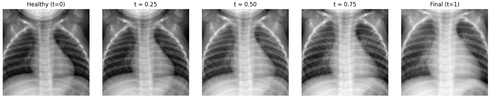
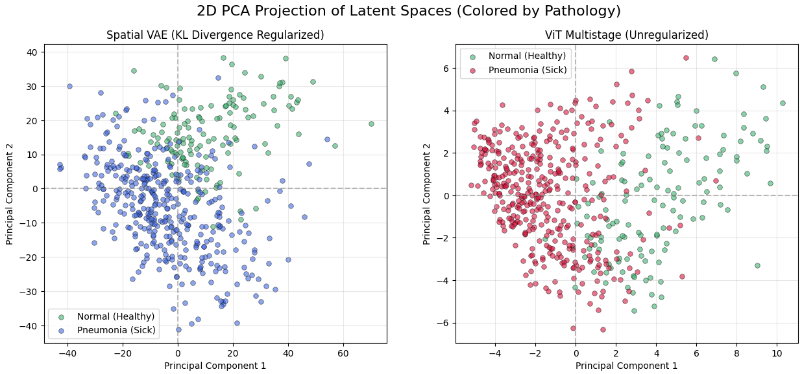
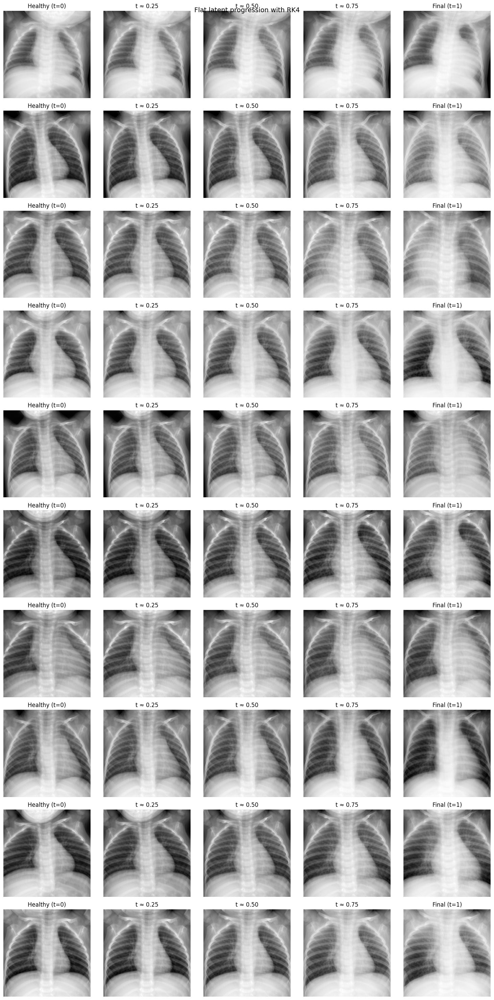
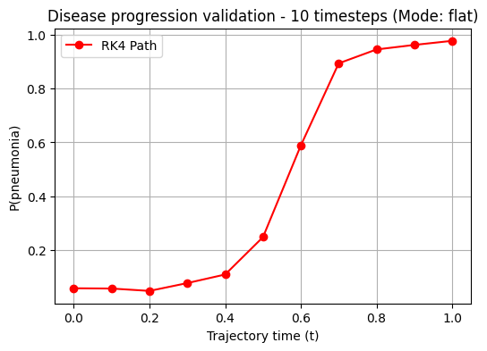
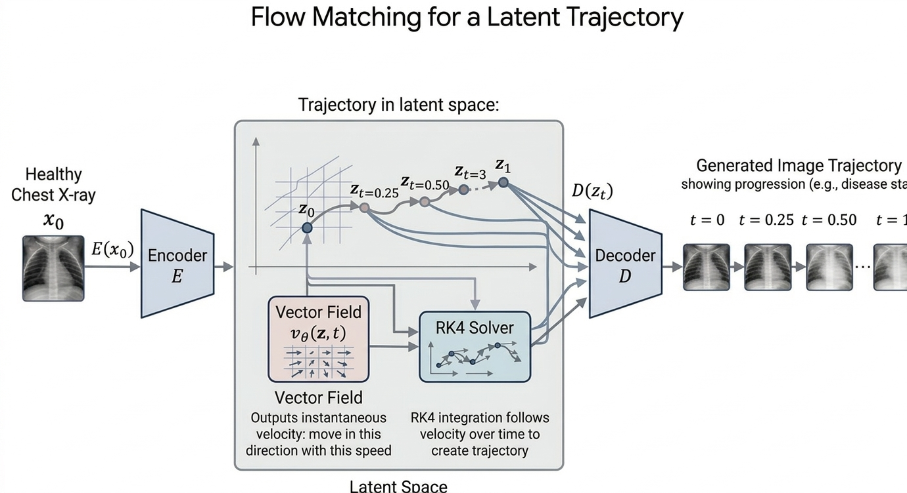

# Flow Matching for Disease Progression in Medical Imaging
### Project-AIDL - Final project for the Postgraduate program Artificial Intelligence with Deep Learning 2025–2026, UPC Barcelona



## Authors
- Arnau Claramunt
- Sandra Márquez
- Sergi Padrés
- Albert Vidal

Project advisor:
- Òscar Pina 

[](https://github.com/ArnauCS03) &nbsp;&nbsp; 
[](https://github.com/sanmarquez) &nbsp;&nbsp;
[](https://github.com/sergipadres) &nbsp;&nbsp;
[](https://github.com/trsk-ndfns) &nbsp;&nbsp;
[](https://github.com/oscar97pina) &nbsp;&nbsp;
---

## 1. Project Summary & Problem Statement

**Goal:** Learn a generative transformation that takes a healthy medical image and produces a partially-ill / progressively-ill image, performing an interpolation along a disease trajectory using Flow Matching.

**The Pipeline:** Image → Encode to latent space → Flow Matching in latent space → Generate a disease trajectory.

Conditional Flow Matching (CFM) is a deep generative model framework that allows for generating samples from one distribution given samples from another, learning a mapping between both distributions parameterized by a vector field. It provides a simulation-free learning step, improving training efficiency over diffusion models.

Our main hypothesis is that CFM is an optimal approach to learn trajectories from a healthy distribution to a sick distribution in the medical imaging domain, specifically utilizing [**PneumoniaMNIST**](https://medmnist.com/) (pediatric chest X-rays), it contains 5,856 pediatric chest X-Ray images. And we used 224x224 images.

We address the high computational cost and artifact generation typical of pixel-space integration by projecting the data into a continuous, regularized latent space.

---

##  2. Experiments & Key Results

We evaluate our pipeline from latent space optimization to the final disease progression synthesis.

#### Experiment 1: Baseline Conditional Flow Matching (Pixel Space)
* **Hypothesis:** Conditional Flow Matching (CFM) can successfully learn a vector field that maps a healthy X-ray distribution to a pneumonia-infected distribution in the medical image domain.
* **Setup (Dataset & Model):** CFM integration applied directly on the pixel space of the PneumoniaMNIST dataset (images scaled to 224x224). We trained a vector field parameterized by a Vision Transformer conditioned on the timestep, randomly sampling from both sick and healthy distributions.
* **Results:** The model successfully learned the vector field dynamics. During inference, Euler integration generated continuous trajectories that pushed healthy origin images towards the pathological distribution. A quantitative evaluation using a classifier confirmed that the probability of pneumonia increased progressively and consistently at each timestep of the trajectory.
* **Conclusions:** We consider this a highly successful baseline experiment. It proves that Conditional Flow Matching is an appropriate and effective approach to modeling disease progression trajectories in medical imaging, validated both by direct visual inspection and quantitative classifier scores.

#### Experiment 2: Spatial VAE vs. Unregularized ViT
* **Hypothesis:** Retaining spatial feature maps via a regularized Convolutional VAE enforcing a $\mathcal{N}(0, I)$ prior yields a denser, more continuous latent topology compared to 1D sequence tokenization (ViT), preventing Out-of-Distribution (OOD) querying during generative sampling.
* **Setup (Dataset & Model):** PneumoniaMNIST (pediatric chest X-rays, 224x224). We compared a Custom Spatial VAE (utilizing `XRV-ResNetAE-101-elastic` as the encoder) against a Multistage Masked Vision Transformer (ViT) Autoencoder.
* **Results:** The Spatial VAE successfully enforced the Gaussian prior, revealing natural unsupervised clustering of pathology. Conversely, the ViT exhibited severe dimensional collapse. 
  * *Structural Fidelity (SSIM):* Spatial VAE achieved **0.88**, vastly outperforming the ViT (**0.62**).
* **Conclusions:** Spatial VAEs provide the optimal, unobstructed continuous path required for downstream Flow Matching, successfully preserving the anatomical proportions of the thoracic cavity.




**Sanity check:** We also ran an “overfit one image” experiment (single sample, no masking) to verify that the autoencoder and training loop can learn a near-perfect reconstruction and confirm the autoencoder works as intended.

---

### Flow Matching Integration

#### Experiment 3: Latent Space Flow Matching
* **Objective:** Accelerate the Flow Matching training process by operating in a lower-dimensional latent space, comparing the representations of the Spatial VAE and the ViT.
* **Hypothesis:** Executing Flow Matching in a compressed latent space will drastically reduce computational costs compared to pixel-space integration (Experiment 1), although some generative accuracy in the trajectories might be compromised.
* **Setup (Dataset & Model):** A Vector Field MLP/FlowCNN was trained on the extracted latents of both the Spatial VAE and the ViT. During inference, we used an ODE solver to push healthy latents towards the pathological distribution, decoding the final steps back to image space. We additionally integrated a DINO model for validation to track the evolution of disease features.
* **Results:** Latent-space integration reduced the vector field training time by an order of magnitude (from ~20 minutes in pixel space to 2-3 minutes). The generated trajectories and DINO validation confirmed that the flow successfully pushed healthy images towards the sick distribution. However, visual fidelity suffered compared to Experiment 1.
* **Conclusions:** While Latent-space Flow Matching is vastly superior in computational efficiency, the standard Euclidean vector field learned over the VAE's latent space is not perfectly capable of flawless trajectory generation. This indicates that the latent manifold geometry requires a non-linear approach, setting the stage for Riemannian Flow Matching in the next experiment.
  
 

*(Note: For a detailed log of intermediate versions, failed approaches, and early testing—such as our ViT MAE tests—please refer to the `CHANGELOG.md` file and the `development/` folder).*

#### Experiment 4: Metric-Regularized Flow Matching with Flat and Spatial Vector Fields
* **Hypothesis:** Incorporating an explicit learned latent metric together with a gamma-corrected interpolation path will stabilize Flow Matching training and prevent trajectories from leaving the data manifold. When combined with a spatial vector field (U-Net) operating directly on spatial latents, the resulting RK4 trajectories should generate smooth, anatomically consistent disease progressions with minimal off-manifold artifacts.
* **Setup (Dataset & Model):** We use PneumoniaMNIST, which contains chest X-ray images labeled as healthy or pneumonia. Images are encoded into latent representations using a pretrained autoencoder. Two latent representations are studied:
* Flat latents: Shape: (256), produced by a ViT-based masked autoencoder and used to train an MLP-based vector field.
* Spatial latents: Shape: (4 × 28 × 28), they preserve spatial structure and used with a U-Net vector field
* **Results:** Once the vector field is trained, the decoded Euler and RK4 trajectories starting from a healthy image and evolving through multiple steps toward pneumonia appear smooth, anatomically coherent, and free of obvious collapse or severe visual artifacts.
* **Conclusions:** We use a learned latent-space manifold penalty inspired by Riemannian geometry.

  In flat latent mode, the learned metric provides a meaningful manifold-aware signal. Corrected paths achieve lower metric cost than straight linear interpolations, indicating that Gamma bends trajectories toward more plausible latent regions. In spatial latent mode, the effect is weaker: the learned spatial latent space is already smooth enough that straight healthy-to-sick interpolations receive manifold scores similar to real data. As a result, Gamma gets only a weak correction signal and introduces little curvature. In this setting, most of the benefit appears to come from the spatial vector field itself, while metric-based correction may become more useful in richer clinical datasets. Future work will explore alternative metric formulations and stronger Gamma architectures, including U-Net-based variants.

  The metric is defined through a score $h(z)$, which measures how close a latent point is to the learned data manifold, and a penalty:
  
  $M(z) = \frac{1}{(h(z) + \rho)^\alpha}.$

  High $h(z)$ means the point is more on-manifold. In this sense, the method is Riemannian-like: it uses a learned conformal weighting over latent space to penalize unrealistic regions. The Gamma value the correction term that bends straight interpolation into a better path under this metric. The learned vector field then captures this corrected flow, producing integrated trajectories that remain stable, improve under the metric, and decode into smooth, anatomically coherent images without obvious collapse.

  Quantitatively, a classifier also indicates consistent progression along the trajectory: as samples move toward the more diseased end of the path, the generated images are assigned a higher probability of pneumonia. This suggests that the integrated latent trajectories do not drift into bad latent regions. Instead, they remain reasonably stable throughout integration and, in the flat-latent setting, stay reasonably stable and even improves under the metric.

  Overall, in our last experiment, **Metric Flow Matching** produced better results than Experiment 3, which did not use a metric, and showed that the 256-dimensional flat latent representation performed better than the spatial latent representation.




Validation with a classification model (DINO) shows that, at the start, the probability of pneumonia is low, then increases in the middle of the trajectory, and ends at a high probability near **𝑡** = 1. This is exactly the kind of behavior we want from a disease-progression trajectory.




<br>

### Summary of the architecture




---

## 3. Repository Structure

```text
Project-AIDL/
├── assets/                     # Final data and visual resources PCA plots and reconstructions for the README
│   ├── development images/     # Intermediate plots, and training progress visuals
│   └── latent_files/           # Extracted latent representations (tensors) from the VAE/ViT
├── checkpoints/                # EMPTY FOLDER (Place downloaded .pth weights here)
├── development/                # Previous versions, deprecated tests, and sanity checks  
├── models/                     # Python scripts (Architectures and Functions)
│   ├── autoencoders/           
│   └── flow_matching/        
├── notebooks/                  # Jupyter Notebooks
│   ├── training/               # Training loops for VAE and Flow Matching
│   └── experiments/            # Final pipeline experiments (Exp 1, 2, 3 and 4) + sanity checks   
├── CHANGELOG.md                # Log of versions, trials, and model surgery
├── requirements.txt            # Python dependencies
└── README.md                   # Summary and instructions

```
---

## 4. Installation

* Clone this repository:

`git clone https://github.com/sergipadres/Project-AIDL.git`

`cd Project-AIDL`

* Install dependencies:

`pip install -r requirements.txt`

---

## 5. Model Weights & Local Setup (Important)
Due to GitHub's file size limits, the pre-trained weights (.pth files) for the Spatial VAE, ViT Autoencoder, and Flow Matching models are hosted externally. To run the evaluation notebooks without training from scratch:

Download the pre-trained weights from this Google Drive link: [Project AIDL](https://drive.google.com/drive/folders/1ZYXsEjA0edhhSSgTYlaL42qbwgy_dtqA?usp=sharing).

Place the downloaded .pth files inside the checkpoints/ folder of this repository.

--- 
## 6. How to Run

Latent Space Validation: Open `notebooks/experiments/experiment-2/experiment-2-multistage-vs-spatialvae.ipynb` to reproduce the latent space topology analysis (PCA) and reconstruction metrics.

**Note**
Python scripts for training the autoencoders are provided under `models/autoencoders`. Training loss and validation history plot is also provided.
An unused variant of the ViT autoencoder (autoencoder_multistage_v2) is also provided. This version uses a ResNext inspired more efficient to train decoder block but was discarded due to lacking reconstruction performance.

Flow Matching Interpolation: Open `notebooks/experiments/experiment3.ipynb` to visualize the continuous translation from healthy to pneumonia using the ODE solver in latent space. 
(Visualize Metric Flow Matching): Open `notebooks/experiments/experiment-4-MFM.ipynb` to visualize the trajectories from healty to pneumonia, using a correction metric and evaluating the results with a classifier.


<br>
<br>

> [!WARNING]  
> Disclaimer: This repository is research/educational work. Generated images are not intended for clinical use.
